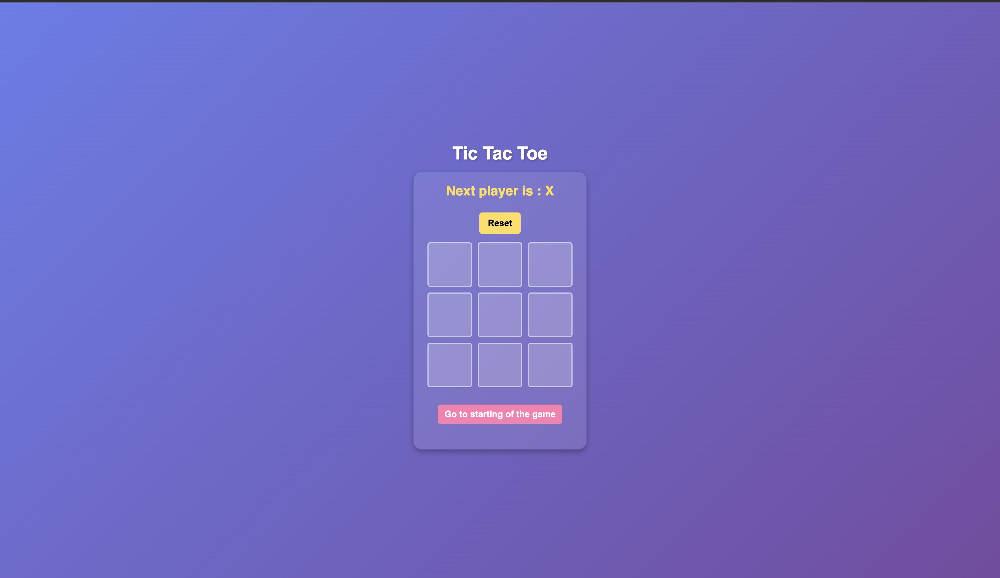

# 🎮 Tic Tac Toe – React Game

A simple and interactive Tic Tac Toe game built using React. It allows two players to play alternately on a 3×3 grid, tracks the winner, and gives the option to restart the game.

### 🔐 Hero Page

---

## 🌐 Live Demo

Play it here 👉 [https://tic-tac-toe-emag.netlify.app/](https://tic-tac-toe-emag.netlify.app/)

---

## ✨ Features

- ✅ Two-player game logic
- 🧠 Winner detection and draw handling
- 🔄 Reset button to restart the game
- ⚛️ Built using React functional components and hooks
- 📱 Fully responsive UI

---

## 🚀 Technologies Used

- React (useState hook)
- HTML & CSS
- JavaScript


## 🚀 Getting Started

### Prerequisites
- Node.js (v14 or above) and npm installed.

### Installation

1. Clone the repository:
   ```bash
   git clone https://github.com/your-username/ai-incident-dashboard.git
   cd ai-incident-dashboard
2. Install dependencies:

``` bash
npm install
```

3.Start the development server:

```bash
npm run dev
```
or
```bash
npm start
```
4. Open http://localhost:5173 in your browser to view the app.

